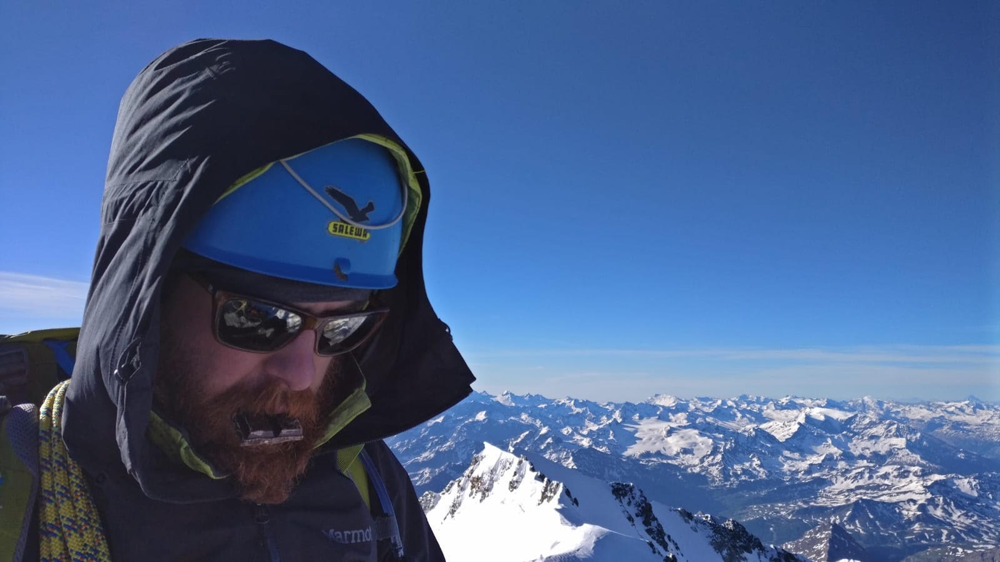

&nbsp;
&nbsp;

I'm currently serving as Chief Strategy Officer at [Weltix](https://www.weltix.tech), a regulated Italian fintech company on a mission to simplify private asset management. Weltix was created to break down the bureaucratic barriers and technological limitations that make private asset management inefficient and hold back companies, investors, banks and intermediaries.

&nbsp;

I also serve as SPV Manager for [Spazio2023](https://spazio2023.space/) and [Cosmos2025](https://cosmos2025.space/), two Special Purpose Vehicles established to invest approximately €10 million through primary and secondary transactions in [D-Orbit S.p.A.](https://www.dorbit.space/), an Italian pioneer in space logistics and orbital transportation.

&nbsp;

Previously, I was Head of Growth and a shareholder at [BacktoWork](https://it.wikipedia.org/wiki/BacktoWork), a platform helping Italian startups raise capital from retail and HNWI investors through syndicates and community rounds. I joined as one of the first employees and had the chance to contribute to the company’s growth through milestones such as a management buyout from [Gruppo 24 Ore](https://it.wikipedia.org/wiki/Gruppo_24_ORE), the acquisition of another startup, a €4M Series A round from [Intesa Sanpaolo](https://group.intesasanpaolo.com/en/newsroom/press-releases/2019/06/CNT-05-000000053513A)'s CVC, and later the acquisition of a majority stake by Intesa itself.  
From 2018 to 2023, we supported companies including [WeRoad](https://www.weroad.travel/), [e-Novia](https://e-novia.it/en/), [Xnext](https://www.x-next.com/), [Contents.com](https://www.contents.com/), [Weart](https://weart.it/), [Davinci](https://davincisalute.com/), and many others, raising more than €80M in total.

&nbsp;

Outside of work, I used to be a professional [short track speed skater](https://en.wikipedia.org/wiki/Short-track_speed_skating) with the Italian National Team, competing internationally. In 2009, I had the privilege of being part of the [European Champion Relay Team](https://en.wikipedia.org/wiki/2009_European_Short_Track_Speed_Skating_Championships). 

&nbsp;

I'm passionate about endurance sports like running, cycling, and mountaineering. Among others, I've summited [Yuhin Peak](https://peakbagger.com/peak.aspx?pid=-82489) (5130m), [Mont Blanc](https://en.wikipedia.org/wiki/Mont_Blanc) (4805m, via the Italian Route), and [Monte Rosa](https://it.wikipedia.org/wiki/Monte_Rosa) (4559m).

&nbsp;

I love being on the road travelling. I've explored more than [50 countries](../../stuff/20211204_travelmap/) so far. In 2014, with 7 friends, I completed the [Mongol Rally](https://en.wikipedia.org/wiki/Mongol_Rally) driving a van from Milan (Italy) to Ulaanbaatar (Mongolia); more than 13.500 km of asphalt and dirt roads.

&nbsp;

If any of this resonates with you, feel free to connect with me on [LinkedIn](https://linkedin.com/in/edoardo-reggiani/), [X](https://twitter.com/EdoardoReggiani), or drop me an email at **e.reggiani**[at]**protonmail**[dot]**com**.

