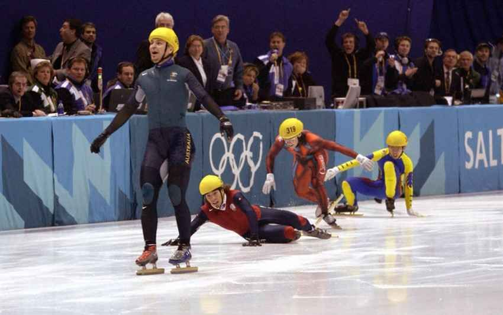

The only reason why you may have heard of short track speed skating is probably related to [Mr. Steven Bradbury](https://en.wikipedia.org/wiki/Steven_Bradbury) and his **epic journey to an Olympic gold medal**. 

&nbsp;

&nbsp;

And, if you come from Italy, you've probably heard about short-track from the [Gialappa's](https://www.youtube.com/watch?v=pBxp_Nx2vfc)

&nbsp;

Short track is a winter Olympic sport where guys and girls try to skate faster than each other, turning left and leaning a lot on a small ice rink. 
&nbsp;

Something like that:

&nbsp;

[*photo credits insidethegames.biz*](https://www.insidethegames.biz/)

&nbsp;

I've done it for a long time, since I was a kid till January 2014, when I quit after failing to qualify for the Olympic Games in Sochi.

&nbsp;

Over the years, I have had the opportunity to represent my country in many international competitions, occasionally with some decent results.

&nbsp;

Here a younger me training before a world cup in Turin, 2013.

&nbsp;

&nbsp;