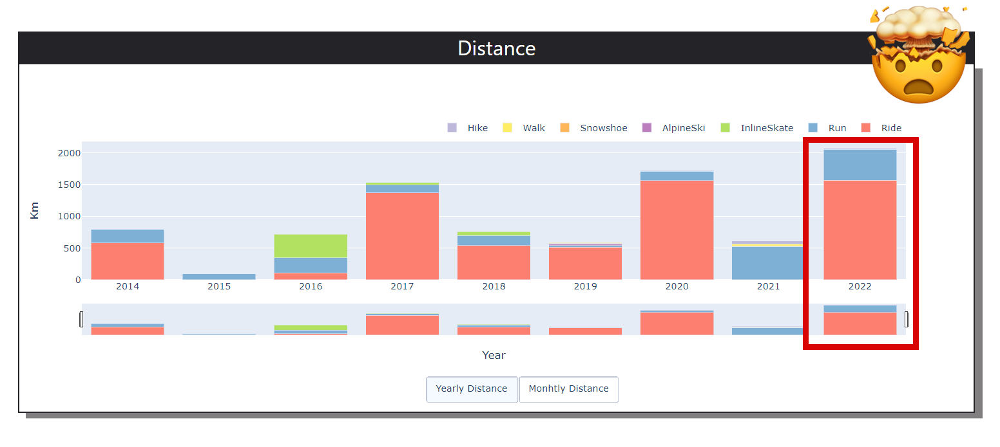

A couple of weeks ago, I decided to create a **dashboard using the Strava API** to gain more insight into my workout data. As a longtime user of the app, I wanted to find a way to view more information about my workouts, even without a premium account 😎. 

&nbsp;

My main goal was to be able to access past data and see how my training has progressed over time. To my surprise, I discovered that 2022 was the year I trained the most since I stopped competing in [short track](/blog/20211201_short_track/) for the Italian national team.

&nbsp;

&nbsp;

The dashboard provides overall statistics and automatically creates individual pages with detailed plots for the selected sports.

&nbsp;

**The complete code for this project is available on [Github](https://github.com/regedo00/strava-data-viz)**, even though it is still a work-in-progress.

&nbsp;

Here is a quick preview of the dashboard.

&nbsp;



&nbsp;

