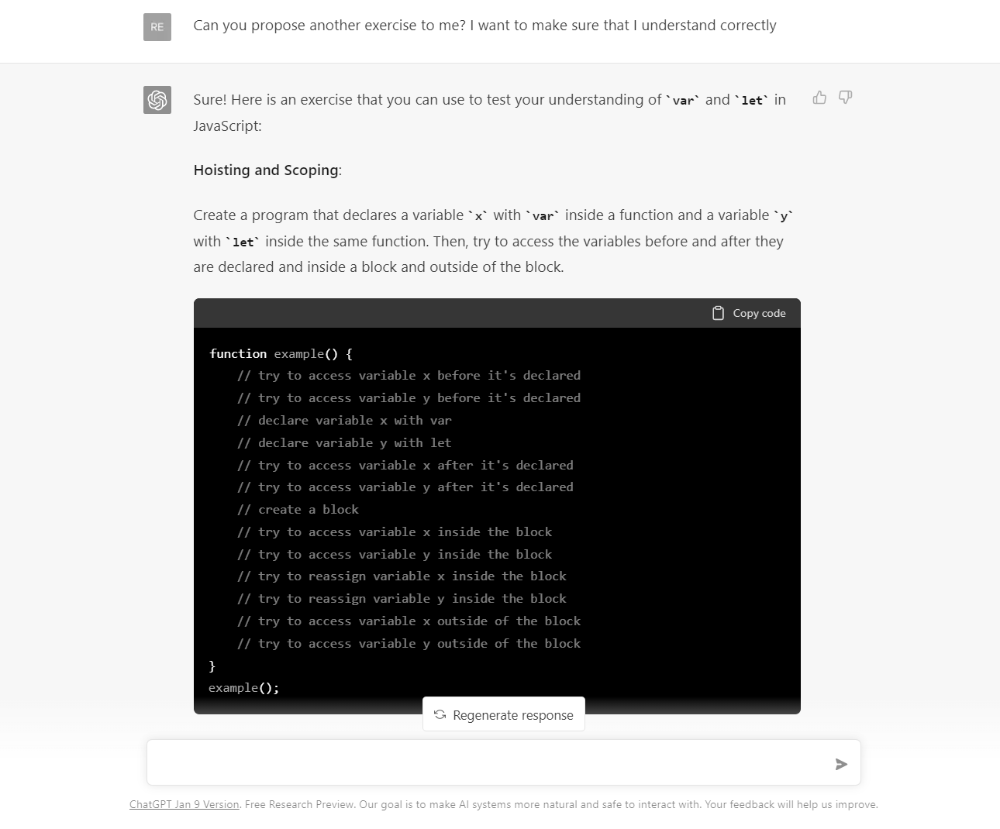

For a few weeks now, I've been contemplating the idea of diving a little bit more into JavaScript. Until now, for my personal coding projects, I have used snippets of JavaScript found on Stackoverflow and handled most tasks on the server-side. However, this approach has its limitations.  

&nbsp;

With the start of the new year, I decided to make it one of my resolutions to learn enough JavaScript to use a proper front-end framework. So I started scouring the internet for learning resources.

&nbsp;

&nbsp;

Like a lot of people on the internet these days, I am also having fun experimenting with the potential of ChatGPT in different areas, from coding to copywriting. So, while I was searching for a JavaScript course, it came to mind that I can try to use ChatGPT to make it teach me JavaScript. 

&nbsp;

I envisioned how great it would be to learn a new programming language with a virtual instructor that can provide real-time question-asking, unlimited new exercises, code testing, etc. The same advantages as a live course, but having the flexibility to do it at my own pace, with a dedicated instructor.

&nbsp;

Sounds too good to be true? Let's find out! 

&nbsp;

Let's start from the basics, can ChatGPT provide me with a JavaScript course? Apparently yes, but it's modest.

&nbsp;

&nbsp;

Ignoring the statement that building a full course would require significant expertise and resources, I asked to focus on the first point. 

&nbsp;

The answer retraces the main types of data used in JavaScript with examples for each of them. Not bad despite perhaps being a little too concise.
Let's move forward to discover "variables and data structure". 

&nbsp;

&nbsp;

At this stage, I have chose to test another possible feature. 

&nbsp;

One of the significant downsides of online courses is the absence of direct interaction with the instructor. In case of confusion on a concept, one may need to resort to forums or internet searches to find answers. This is where a virtual instructor can be incredibly valuable. Not only it can provide a vast array of knowledge, but it can also respond to specific questions from users in real-time. 

&nbsp;

&nbsp;

Wow, exactly as I thought! The model responded to my question immediately, providing examples as well. It's truly amazing to think about the amount of time I saved compared to a traditional online course. However, to ensure that I fully understand the concept, I want to do an exercise right away. 

&nbsp;

Let's see how it performs on this question.

&nbsp;

&nbsp;

Hmm, first issue. The model comprehended the question and identified the need, however, I personally would have preferred the exercise without the solution. Instead, it provided the exercise and solution together. 

&nbsp;

Let's see how it goes by asking it to propose some exercises without a solution.

&nbsp;

&nbsp;

Okay, this time it worked as I expected. I am presented with two exercises, without solutions, that test my understanding of two different concepts (scoping and hoisting). This is very interesting. Now, all that remains is to input the answer for the first exercise and observe the outcome.

&nbsp;

&nbsp;

Alright, this is not what I was expecting. 

&nbsp;

The answer is somewhat unclear and, more importantly, it is incorrect. The outputs provided by me and ChatGPT are the same, but it appears to not recognize that. This is strange.
Let's try to bring attention to it and see what happens next.

&nbsp;

&nbsp;

This time the output is accurate, as well as the explanation for the exercise solution. It was not instantaneous but we eventually got to the correct answer. 

&nbsp;

Now, I want to evaluate if it understands the proper way to generate exercises by requesting it to present another one.

&nbsp;

&nbsp;

We are making progress, and it appears that the model has comprehended how to present exercises. It's also noteworthy that it offers a suggestion in the response on how to test the solution by saying: "You can attempt to predict the outcome before executing the code, and then use the browser's developer tools or Node.js to execute the code and evaluate your understanding."

&nbsp;

This is yet another impressive feature compared to traditional courses: the capability of obtaining personalized exercises upon request.

&nbsp;

Let's proceed to the next section of the course now.

&nbsp;

&nbsp;

This exercise has come to an end.

&nbsp;

While my goal of learning JavaScript is genuine and using ChatGPT is intriguing, it may not be the most suitable option for me at the moment, despite the potential it holds.

&nbsp;

A structured course, designed by experienced educators, is likely still the best way to quickly achieve my goal of learning something new. However, ChatGPT could be a valuable supplement to an online course. It can be used to ask real-time questions, receive new exercises, and save time in understanding concepts that may be unclear.

&nbsp;

For my current goal of learning a bit of JavaScript, I plan to take a hybrid approach for efficient progress.

&nbsp;

This experience has shown me the potential of AI in the field of learning, despite the risk of incomplete or inaccurate information. 

&nbsp;

Users will need to be trained to use the prompts effectively to obtain a plausible result, but just as the internet has made information readily available and search engines have made it easy to find, this technology could represent the next step in which not only information is easily accessible, but also organized in real-time, making learning more efficient.

&nbsp;

I believe that in the coming months and years, AI will become an essential tool for anyone looking to learn new things, whether it be through fully AI-generated courses with AI-generated avatars, or as a supplement to existing tools.