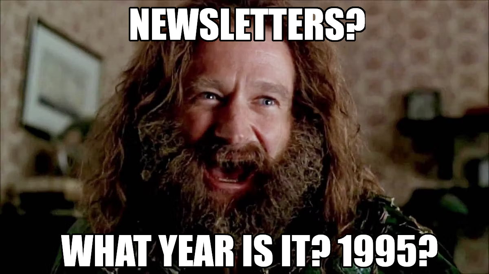

Eight weeks ago, almost by chance, I took a leap of faith and launched a weekly newsletter. Pretty original in 2023, right?😅 

&nbsp;

It all started on a lazy Saturday morning when I was scrolling through social media. That's when it hit me - why not compile a list of interesting tech stuff I'd read during the week and share it with others?

&nbsp;

Choosing LinkedIn as my platform made sense. It's where I have the easiest time reaching a decent audience, and let's face it, there is tons of mediocre content out there. A few links to interesting articles and reports couldn't hurt!

&nbsp;

The feedback I received, even from people I hardly knew, was quite positive. That got me thinking, "Why not try to do a weekly newsletter then?"

&nbsp;

Introducing...

Sure, there's already plenty of tech-related content out there, but who has the time to sift through it all? A weekly summary could make sense, especially for those not yet working in the industry.

&nbsp;

Additionally, in Italy, I think it's important to give visibility to what's happening abroad in the startup/vc/tech industry.

&nbsp;

And so, [my little side project](/trw) was born.

So far, I'm having a blast! The pressure to hunt down exciting articles, reports, and whatnot every week is a great motivator to keep learning and delve into different topics.

&nbsp;

In conclusion, I'm not sure where this project is headed, whether it'll die for lack of time or grow significantly, but it has given me a platform to share my passion for tech and connect with others who share the same interests.

&nbsp;

And hey, if you're reading this, why not [subscribe](https://www.linkedin.com/newsletters/%E2%98%95tech-readings-of-the-week-7039008827605692416/) and join the fun?
