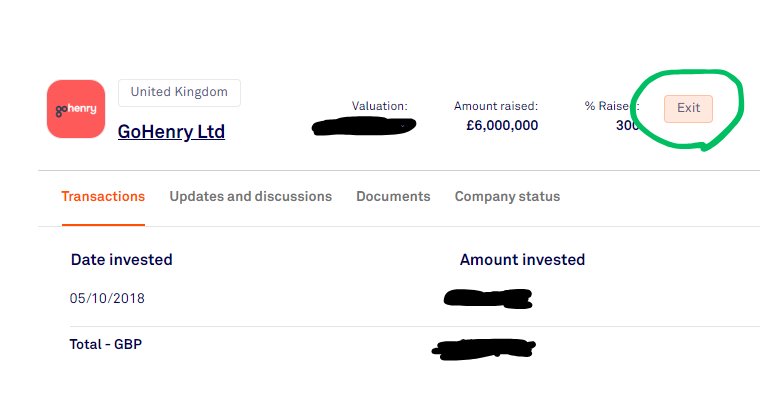

&nbsp;

A few days back, I received the payout from the exit of a startup I'd invested in some time ago. 

&nbsp;

This investment was made through a crowd investing platform (full disclosure: not the one I work for), so the amount was modest.

&nbsp;

And given the multiple on my investment (single digit), this outcome will mostly help offset some write-offs from other startups that didn't make it 😅. 

&nbsp;

Nonetheless, I believe there are some valuable insights to share with those contemplating investments in startups through a crowdfunding platform, especially since it's Financial Education Month here in Italy.

&nbsp;

1) **Investing in startups is a long-term game**, and that's not just a clichè. In this case, it took nearly six years to see a return. These were crucial years for the company's growth, both in terms of business volume and value. If you're seeking rapid returns, this path may not be the right fit for you.

&nbsp;

2) Even with a seven-figure pre-money valuation, such as in this case, substantial growth potential in terms of business can lead to returns even for private investors. However, IMHO,**when investing through crowdfunding, the earlier the round you invest in, the better**. 

&nbsp;

3) Diversify! The example I'm writing about underscores how a single-digit multiple won't significantly impact your portfolio performance (unless you are a late-stage investor, maybe). **Startup investing is a power law game**, so it's crucial to diversify enough to cushion potential setbacks while aiming for moonshots that can generate an overall return. 

&nbsp;

4) **Even during a liquidity event, maybe not all investors get to see the cash**. I'm not talking about returns; I mean actual cash! This depends on the type of shares you hold and numerous other factors, some of which are beyond your control. Take the concept of liquidation preference, for instance. If you're unfamiliar with these mechanisms, dedicate time to **study them or seek advice from an expert before making any investments**.

&nbsp;

I hope this real-world example can provide valuable insights for those venturing into startup investments through crowdfunding 🚀