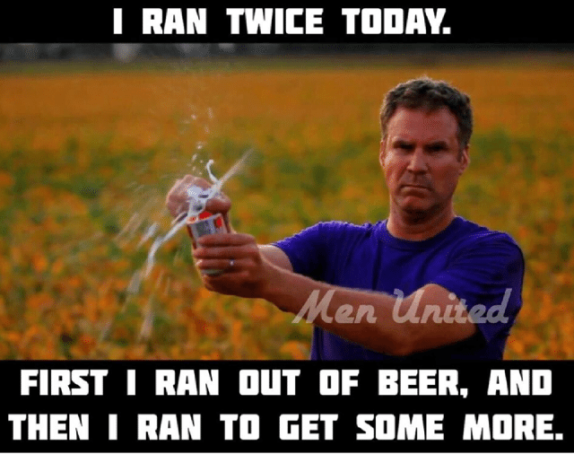

As of February 2022, two months after left shoulder surgery, I've finally decided it was time to get back into training. As I approach my mid-thirties, I believe it's essential to combat the physical decay that comes with a desk job.

&nbsp;

I dusted off my running shoes and started training with the goal of running a half marathon in the coming months. I even signed up for race in the spring.

&nbsp;

&nbsp;

But four days before the event, I was hit with Covid-19. Needless to say, I was extremely frustrated and lost some of my motivation.

&nbsp;

However, the days were getting longer, and the weather was improving, so I decided to switch things up and start biking regularly. I even brought my bike on vacation and rode it through a tropical storm!

&nbsp;

&nbsp;

Despite the setbacks, I've managed to keep training regularly, at least 2-3 times a week, and have even lost six kilograms!

&nbsp;

So, note to self (and anyone else reading this), it's not about whether you run or ride. The most important thing is to get off that couch and start moving!
