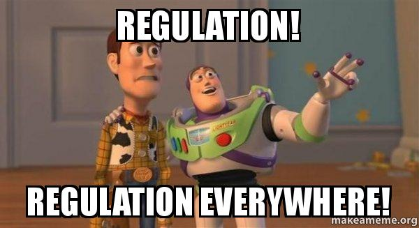

 

In a [recent speech](https://www.youtube.com/watch?v=F9cO3-MLHOM), Bill Gurley, General Partner at Benchmark, shed light on how regulation often stands in the way of innovation, sharing some insightful examples.

 

Now, who usually benefits from this scenario? You guessed it – the incumbents, as they often wield more influence over regulators.

 

But does this dynamic always benefit society? Well, probably not.

 

Perhaps you've stumbled upon this quote from the same speech: "The reason Silicon Valley has been so successful is because it’s so fucking far away from Washington, DC."

 

This quote resonates with critiques about Europe's struggle to innovate at the same pace as the US, partly due to excessive regulation. 

 

Italy undoubtedly stands out as one of the most prominent examples of this challenge.

 

The ongoing clash between innovation and regulation is a hotly debated topic, often resembling a race to see which one prevails.

 

I have been dealing with regulations and regulators a lot in the past few weeks. And it's made me quite sensitive to this topic.

 

Now, here's my stance: I don't dispute the importance of regulation; there comes a point where it's essential. Otherwise, the risks might overshadow the benefits, especially concerning societal impacts. Crypto could be an example.

 

Yet, I firmly believe that regulation should evolve hand-in-hand with innovation. Rushing in with too many rules too soon can smother even the most promising innovations, preventing them from reaching their potential.

 

The risk of missing out on groundbreaking opportunities, due to overly cautious regulators is something we can't afford, especially in these turbulent times.

 

Of course, balancing this equation is incredibly tough. However, if regulators don't heed the voices of innovators, maintaining competitiveness becomes an uphill battle.
