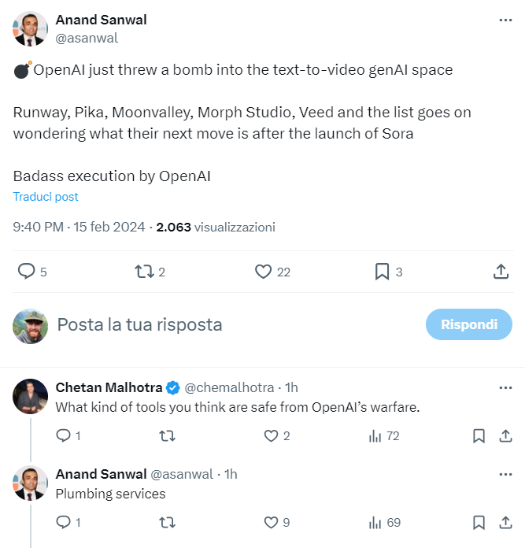
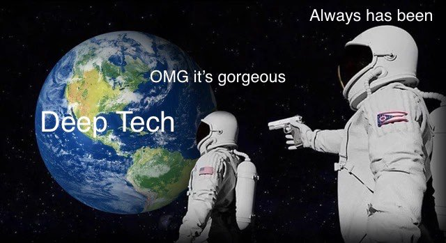
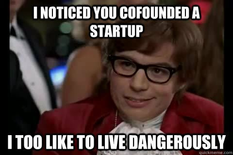

*DALL-E prompt: "give me a 16:9 image showing a future where entrepreneurship is no more"*

&nbsp;

&nbsp;

The release of OpenAI's Sora has sparked a series of thoughts.

&nbsp;

Within a few hours, LinkedIn and X were flooded with AI-generated video content of stunning quality. 

&nbsp;

Numerous posts emphasize how OpenAI may have dealt a critical blow to other, smaller text-to-video startups.

&nbsp;
&nbsp;

&nbsp;
&nbsp;

Reading those posts led me to a broader concern, extending beyond text to images, videos, or whatever. It's about the entrepreneurship in the future.

&nbsp;

A bit of an exaggeration? Maybe not.

&nbsp;

Historically, technological advancements have phased out jobs and companies, while also giving rise to new business models and job opportunities. 

&nbsp;

Until now, this equation has yielded positive outcomes. At least in my humble opinion.

&nbsp;

Disclaimer: This post isn't about AI destroying the job market.

&nbsp;

However, today's AI industry presents a stark 'winner-takes-all' scenario, surpassing even the traditional venture-backed industries.

&nbsp;

Despite its software nature, the industry is akin to deep-tech dynamics, demanding significant initial investments and presenting high barriers. 

&nbsp;

Foundational AI startups like OpenAI, Anthropic, and Mistral, together with a few incumbents such as Google and Meta, are good examples of this trend. These companies have amassed billions of euros in funding.

&nbsp;

Looking back to past decades, there have always been 'hard technologies' that require hefty investments for development. For instance, the development of space or energy technologies over the past decades needed considerable capital for advancement.

&nbsp;
&nbsp;

&nbsp;
&nbsp;

In contrast, alongside these capital-intensive, industry-transforming technologies, there have always been less capital-intensive businesses that started as small-scale, almost artisanal activities, and then grew (organically or inorganically). 

&nbsp;

How many mid to large-cap companies today had humble beginnings and have now reached their third or fourth generation of entrepreneurs? The Italian entrepreneurial landscape, which counts on a lot of SMEs founded in the 50s and 60s, is an excellent example of this.

&nbsp;

Just as manufacturing companies defined Italy at the end of the 20th century, software companies have played a similar role in recent years, where minimal initial capital was required to develop a product and, if it got PMF, scale its sales.

&nbsp;

On top of that, we can also add the creator-based kind of business, where (probably) even less capital is needed to bootstrap. 

&nbsp;

The new dynamic here lies in the fact that the advancement of AI technology, which requires huge investments for its development, risks leading to the disappearance of countless business models, given that top-notch AI will have the capability to supplant teams (and companies) involved in the development of new software.

&nbsp;

How much do we risk raising the bar too high for launching a business capable of bringing a product to market? This could consequently discourage the rise of new entrepreneurs. 

&nbsp;
&nbsp;

&nbsp;
&nbsp;

Perhaps this argument is today easily applicable to software, but it can also extend to the physical world, where typically even more capital is needed.

&nbsp;

And if entrepreneurship is discouraged, what are the risks for society? Are we facing a scenario where (more than today) aggregators of capital and technology are the only entities, together with governments, governing market offerings? 

&nbsp;

Are we about to see the end of the bootstrapped entrepreneurship era? And how will the venture industry evolve in this mutated scenario? Will capital become increasingly concentrated?

&nbsp;

Obviously, I don't have the answers to these questions, and it is not my goal to provide answers here.

&nbsp;

Just as Sora represents a leap forward in AI capabilities, it also exemplifies the emerging challenges and realities for startups and entrepreneurs.

&nbsp;

This dynamic probably reflects the challenges humanity has repeatedly encountered with new technologies, although this time it seems to be on steroids.

&nbsp;

While the landscape is transforming, I remain confident that, as always, entrepreneurs and dreamers will always find new ways to build something new, perhaps ones we have yet to envision.

&nbsp;

We need it, let's not forget that.