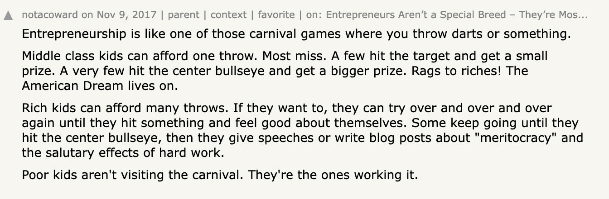

&nbsp;

Is launching a startup that requires VC money for everyone?

&nbsp;

&nbsp;

I just read this [this](https://openvc.app/blog/venture-capital-isnt-for-the-poor) insightful article by Stephane Nasser, co-founder of OpenVC, that provides a reality check on the idea that creating VC-backed startups is a fully meritocratic way to generate wealth.

&nbsp;

The bad news is that it isn't, for many reasons. One of them is that it's very hard for not-wealthy founders to financially afford the risk of failure.

&nbsp;

A suggestion on how to deal with this issue is to, and I quote, "...build some level of personal wealth first, then only after a safety net is in place, go the VC route."

&nbsp;

To reach this goal, working for a big (tech) company for a few years could be a valuable and low-risk solution.

&nbsp;

Of course, this is a good strategy that can de-risk the founder's journey a little, but it highlights another challenge.

&nbsp;

In many countries with small/emerging tech ecosystems, it is difficult in the first place to reach a decent level of personal wealth, and that makes venture capital even more "not for the poor".

&nbsp;

If local (tech) companies do not pay salaries that allow employees to build financial stability in just a few years (Hello Italy!), will those not-wealthy employees ever be able to take the risk of building a startup and raise VC money to scale it?

&nbsp;

And what is the cost for the ecosystem in terms of lost opportunities? 

&nbsp;

Once people move to other ecosystems looking for better-paid jobs, what are the chances that they go back to the emerging one to launch a new startup?

&nbsp;

When talking about the impact of venture money going into an (emerging) ecosystem, I believe this matter should be given great consideration.

&nbsp;