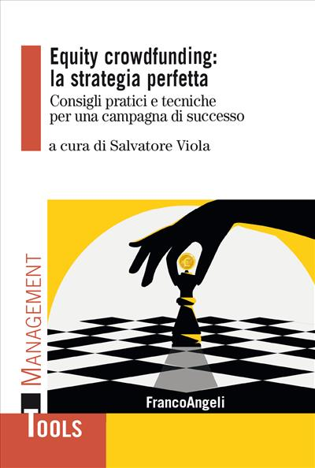

&nbsp;

**Disclaimer:** I do not make any money out of it! 

&nbsp;

If you are an Italian founder considering launching a community round (or equity crowdfunding campaign) it is not a bad idea to give it a shot.

&nbsp;

[The book](https://www.francoangeli.it/libro/?Id=28248) dives deep into practical stuff. Besides myself, there are insights from 12 top-notch experts in Italy, each rocking their own expertise. 

&nbsp;

Before reaching out to platforms or being swayed by the promises of some consultants (who may not necessarily sell smoke, but the risk is high), think about it! 

&nbsp;

And hey, if you want free feedback about launching a campaign, hit me up! 

&nbsp;

I'm always up for a chat.
